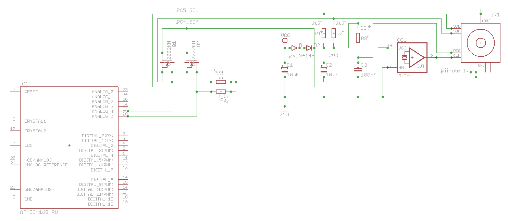

# PVision
Arduino library to interface to WiiMote/Pixart camera sensor


```
#include <Wire.h>
#include <PVision.h>

PVision ircam;
byte result;
byte MIDIbyte;

short candidate;
short newcandidate;

void setup()
{
  Serial.begin(31250); // MIDI speed
  ircam.init();
  candidate = 1023;
  newcandidate = 1023;
}

void loop()
{
   
  // First handle any pending MIDI data
  while(Serial.available() > 0)
  (
    Serial.print(Serial.read(), BYTE);
  }
  
  result = ircam.read();
  
  newcandidate = 1023;
  
  if (result & BLOB1)
  {
    if (ircam.Blob1.Y < newcandidate)
      newcandidate = ircam.Blob1.Y;
  }
  if (result & BLOB2)
  {
    if (ircam.Blob2.Y < newcandidate)
      newcandidate = ircam.Blob2.Y;
  }
  if (result & BLOB3)
  {
    if (ircam.Blob3.Y < newcandidate)
      newcandidate = ircam.Blob3.Y;
  }
  if (result & BLOB4)
  {
    if (ircam.Blob4.Y < newcandidate)
      newcandidate = ircam.Blob4.Y;
  }

  // Short delay...
  delay(10);
}
```
